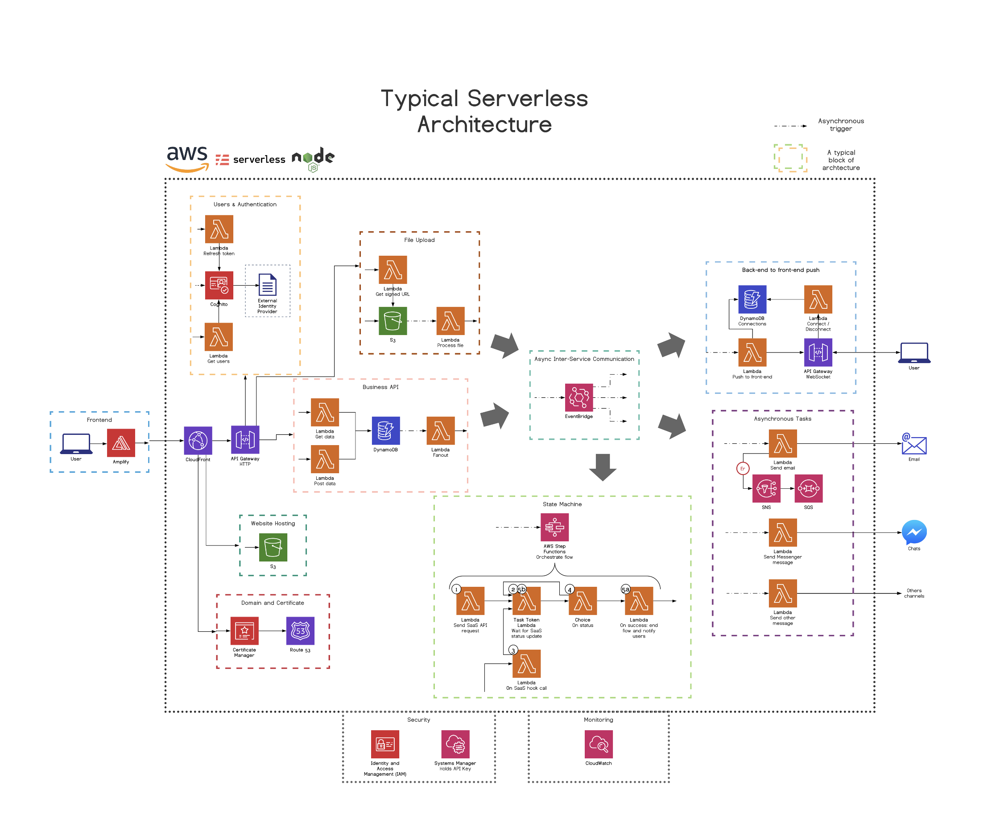
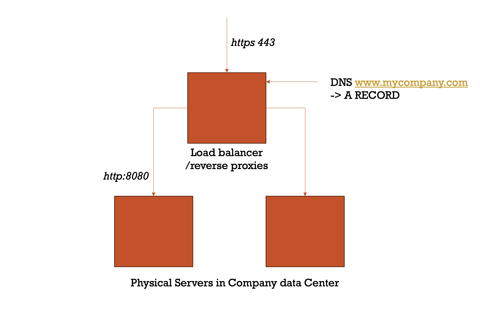

# Group Exercise - Contrasting architectures 

## Instructions for Students:

1. Form teams of 3-5 members.
2. Look at the two diagrams on this page. It consits of two entirely different architectural approaches: a monolithic architecture and a serverless cloud architecture.
3. Take 15-20 minutes to review the diagrams with your team and discuss the benefits and drawbacks of each architecture.
4. Consider aspects such as scalability, maintainability, deployment complexity, cost, performance, and developer productivity during your discussion.
5. After the discussion, each team will present their observations to the class.
6. Share your team's insights regarding the benefits and drawbacks of each architecture.

Other teams:

8. Listen to other teams' presentations and take note of additional points that may not have been discussed in your group.
8. Participate in the class discussion following each team's presentation to clarify points and contribute further insights.
9. Reflect on the key differences and considerations between the two architectures as summarized by the instructor.

Do you think monoliths will re-appear? Will we be attending Monocon 2030?

## Architecture option 1 - Modern Serverless Architecture 

Typical Serverless Architecture  components

* The Orange sympols denoted with a greek Lambda, are AWS lambda functions. Pieces of application code that needs a soruce code repository, build & deployment pipelines, unit tests, etc. 
* Step functions is used to Orchistrate lambda functions and workflows
* Blue icons with the label ; Dyanmo DB is a no-SQL database 
* green Icons with a Bucket; S3 is file hosting for websites, media or entire data lakes 

### Users & Authentication
- **AWS Cognito**: Manages user authentication and identity, ensuring secure access to the application.

### File Upload
- **Amazon S3**: Object storage service for uploading files.
- **AWS Lambda**: Compute service that can be triggered to process files after they're uploaded.

### Frontend
- **S3 & CloudFront**: Services for hosting the user interface of your application. CloudFront distributes the content with low latency across the globe.

### Business API
- **AWS Lambda**: Runs backend logic in response to HTTP requests via API Gateway.
- **Amazon DynamoDB**: NoSQL database service for storing and retrieving data.

### Asynchronous Trigger
- **AWS SNS & SQS**: Messaging and queuing services for event-driven, asynchronous workflows that trigger Lambda functions.

### Back-end to Front-end Push
- **WebSocket & AWS API Gateway**: Enables real-time communication between the backend and frontend clients.

### Asynchronous Tasks
- **AWS Step Functions**: Coordinates multiple AWS services into serverless workflows.
- **AWS SES**: Email service for sending notifications and other communications.

### Monitoring
- **AWS CloudWatch**: Monitors application performance, logs data, and sets alarms for resource usage.

### Security
- **AWS WAF & Shield**: Protects the application from web exploits and DDoS attacks.

Each component in this architecture represents a piece of the serverless puzzle, working together to create a scalable, efficient, and manageable application without the need for traditional server management.

## Architecture Option 2 - The monolith 

We can also imagine the same business logic as above implemented in such a way that all business requirements 
were implemented as a monolithic application handling all of the above mentioned features - from 
file upload to UI presentation layer. 

